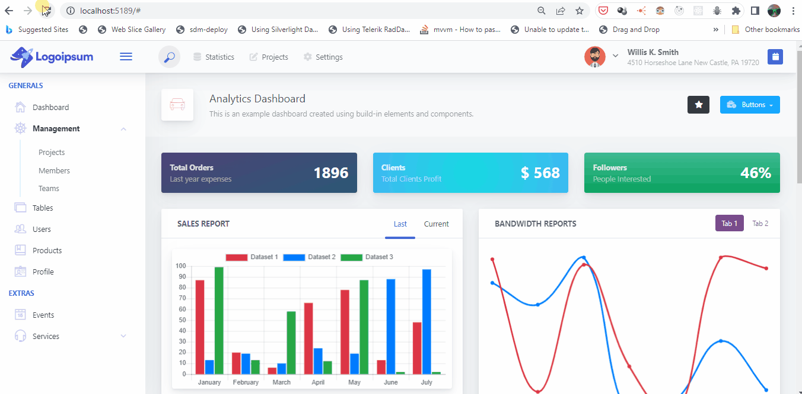

# AdminLTE_Bootstrap

# Info

This repository represents a realization of the practical exercise of the following link [How to Integrate AdminLTE with ASP.NET Core? Detailed](https://codewithmukesh.com/blog/integrating-adminlte-with-aspnet-core/) and looks like this:

### Usefull links

[How to Integrate AdminLTE with ASP.NET Core? Detailed](https://codewithmukesh.com/blog/integrating-adminlte-with-aspnet-core/)
[PE7 Icons](https://coderthemes.com/uplon/layouts/vertical/icons-pe7.html)
